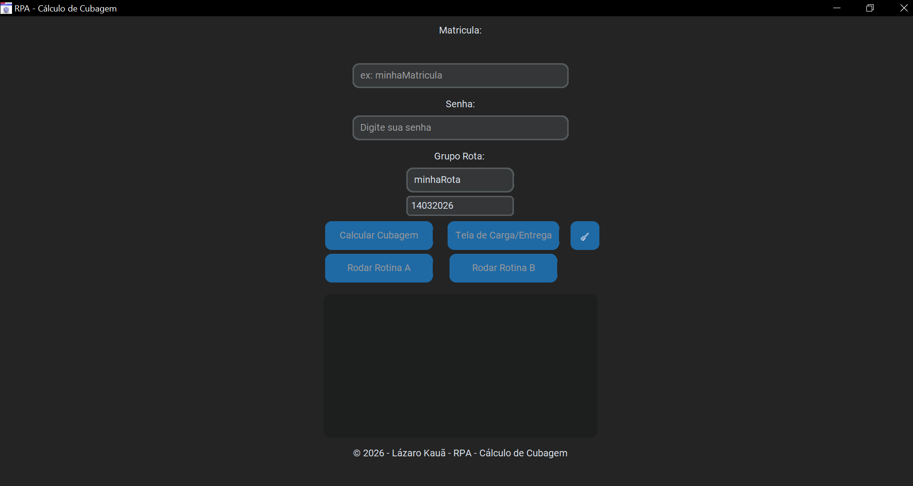

# 🚀 RPA - Mainframe Logistics Automation

## 📌 Visão Geral do Projeto
Este projeto é um **Sistema de Automação de Processos Robóticos (RPA)** construído em Python, focado em otimizar de forma inteligente a logística de distribuição e roteirização. A automação se conecta de forma assistida a instâncias do terminal do Mainframe (Legado) via interface COM (Component Object Model). O robô realiza o **Screen Scraping** de dados textuais para recuperar informações de cargas, as processa, e as aloca progressivamente nos boxes corretos com base no espaço ainda disponível.

Por meio de uma interface fluída na área de trabalho, os administradores da logística podem comandar coletas complexas e acompanhar em tempo real o console de logs unificado.

## 🛠️ Stacks Utilizadas
- **Core:** Python 3.11+
- **RPA & Scraping:** `pywin32` (Para integração e espelhamento OLE Automation do emulador do Mainframe).
- **Dados & ETL:** `pandas`, `openpyxl` (Extração de relatórios, tratamento de matrizes temporárias e cálculos massivos).
- **Interface Gráfica (UI):** `customtkinter` (Para criar uma UI minimalista, escura e de alta legibilidade).
- **Build/Deployment:** `PyInstaller` (Criação do pacote executável `OneFile` independente do ambiente Python da máquina cliente).

## 📊 Pipeline de Dados (Screen Scraping e ETL com Pandas)
O ciclo completo substitui as antigas planilhas manuais:
1. **Extract (Scraping Inteligente):** O script lê blocos vetoriais das coordenadas cartesianas do Mainframe (linhas/colunas), identificando páginas limpas ou com sufixos textuais de navegação.
2. **Transform (Processamento):** A string crua é vetorizada e jogada no `pandas`. Remoções de espaços, _casts _ seguros (transformando literais como `"10,4"` em floats numéricos `10.4`), padronização e merges contra as tabelas estáticas das _filiais_ limpam os dados defeituosos.
3. **Load (Carga em Repositórios):** Novas planilhas de controle diário (`.xlsx`) são automaticamente moldadas e exportadas pelo Pandas para distribuição ao time operacional.

## 🧠 Algoritmo de Alocação de Cargas (FFD)

Para garantir que cada caminhão seja aproveitado ao máximo e que as entregas fluam sem gargalos, implementei o algoritmo **First Fit Decreasing (FFD)**. Ele funciona de um jeito simples e muito eficiente:

- **Passo 1: Organização (Decreasing):** Primeiro, o sistema olha para todas as cargas e as organiza da maior para a menor (por cubagem). Isso é estratégico: as peças "grandes" são prioridade para garantir que os espaços principais sejam preenchidos primeiro.
- **Passo 2: Primeiro Encaixe (First Fit):** O robô percorre a nossa lista de boxes disponíveis e aloca a carga no **primeiro** box que tiver espaço suficiente.
- **Regras de Ouro (Restrições):** Mesmo com a automação, respeito regras específicas de negócio, como o "Match de Exclusividade" (ex: Rotas Leves obrigatoriamente em Boxes tipo A).
- **Segurança:** Caso uma carga seja grande demais para qualquer box disponível, ela é sinalizada para alocação manual, evitando erros no despacho.

## 📈 Ganhos e Métricas
*   **Velocidade:** Processos longos de validação de cubagem e roteamento que demoravam quase ``1 hora`` manualmente agora rodam por terminal em menos de ``60 segundos``.
*   **Qualidade:** A automação atinge 100% de compliance eliminando completamente os equívocos de arredondamento humano ou desvios de filiais incorretas.
*   **Otimização Física:** Evita despachos de veículos vazios pela densificação ótima dos boxes (uso eficiente de 100% da volumetria disponível antes do transbordo).
*   **Transparência:** Adoção de trilhas de auditoria constantes. O output diário é acumulado e logado perfeitamente no Excel evitando perdas de informação.

## Tela de Interface Gráfica


## 🚀 Como Executar

### Pré-requisitos
- **Python 3.11+**
- **Emulador de Mainframe** configurado com suporte a interface COM (ex: IBM Personal Communications, Attachmate Reflection).
- Instalação das dependências:
  ```powershell
  pip install -r requirements.txt
  ```

### Rodando o Robô
Basta executar o script principal na raiz do projeto:
```powershell
python src/main.py
```

## 📦 Distribuição e Build

O projeto conta com um script automatizado para geração do executável `.exe` independente, garantindo que o usuário final não precise ter Python instalado.

Para gerar um novo build:
1. Abra o PowerShell na raiz do projeto.
2. Execute o script de build:
   ```powershell
   ./build_app.ps1
   ```
3. O executável será gerado na pasta `dist/` com o nome **RPA - Calculo de Cubagem**.

## ⚠️ Aviso Legal e Segurança

Esta automação interage diretamente com sistemas legados via interface COM.
- **Ambiente:** Certifique-se de que a sessão do Mainframe esteja ativa e logada na tela correta antes de iniciar.
- **Responsabilidade:** O uso desta ferramenta deve seguir as políticas de segurança de dados e acesso da sua organização.

---
Desenvolvido com ❤️ para otimização logística.
